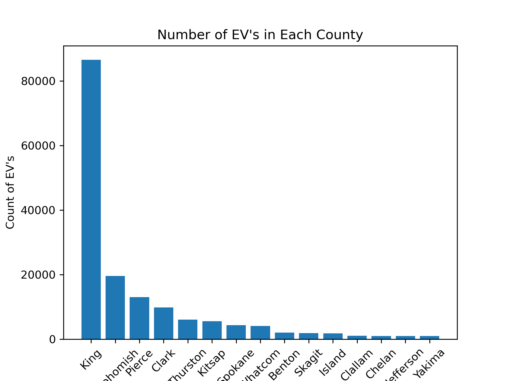
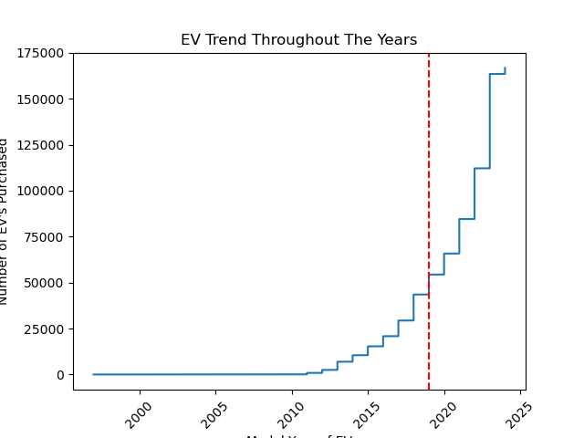
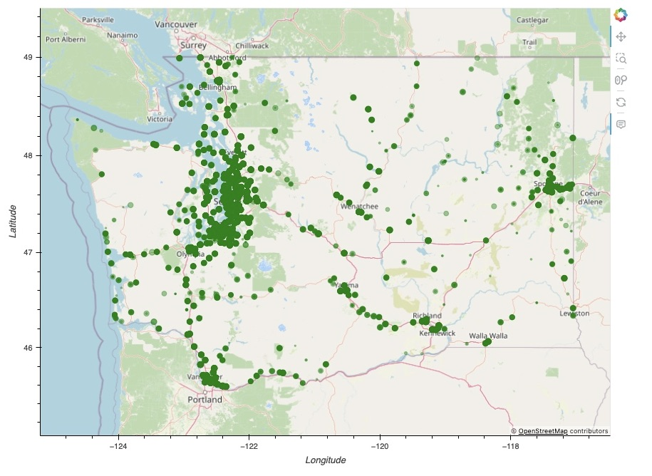
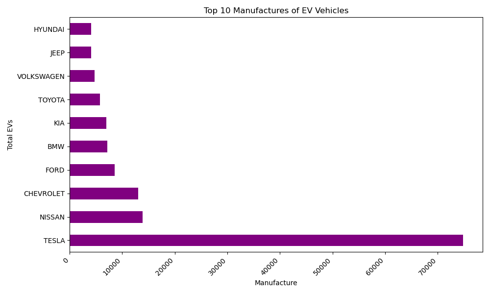
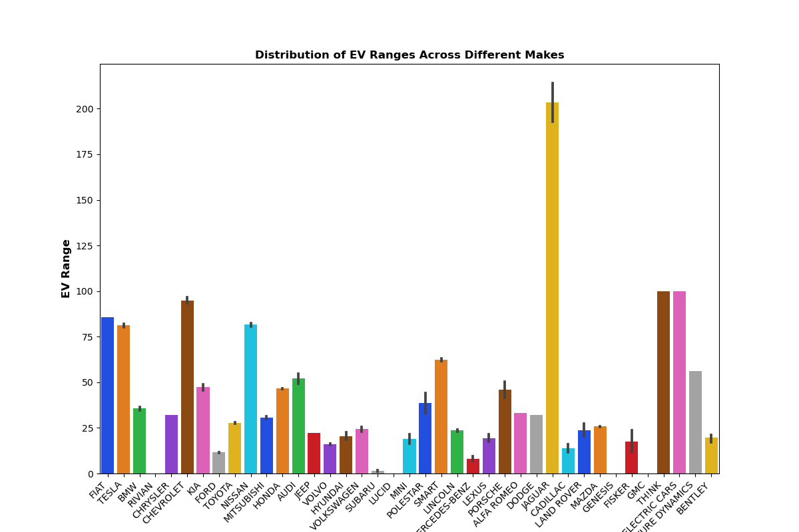
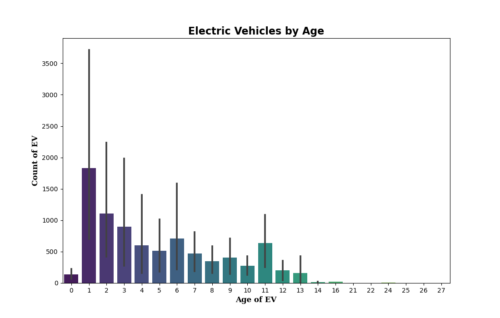

# Project-1-
A Washington State elctric vehicle trend slideshow by Holly Miesbauer and Tony Cota

This is a study examining electric vehicle trends in Washington State. The scope of the study:
Age of vehicles currently in circulation
Electric ranges of the vehicles
The impact of car rebates, federal and local incentives (if any) on purchasing electric vehicles
Visualize and demonstrate the exponential rise in electric vehicles in Washington State
Deliver information regarding major manufacturers plans to convert to full lines of EV's, ultimately outdating internal combustion vehicles obsolete\

ANALYSIS OF ELECTRIC VEHICLES IN WASHINGTON STATE
Data is sourced from Data obtained from https://catalog.data.gov/dataset/electric-vehicle-population-data
Information provided is a high level summary for electric vehicles in the state of Washington
graphs include information regarding trends over the past 3 decades
graphs discuss data regarding tax incentives/rebates/exemptions for purchasing an electric vehicle
slideshow demonstrates major car maufacturers expected EV lineup dates
presentation shows location of EV's in WA and their electric range
slides demonstrate null hypothesis to be true over initial hypothesis

Link to Google Slide presentation:
https://docs.google.com/presentation/d/10cIOzyaeveJLomhGdGh6LheSEjdEMW3b4MFBUzGBSs4/edit?usp=sharing

graphs requested:

Used the Pearson correlation coefficient to determine if there was a correlation between car manufacture and electrical vehicle range
Weak positive correlation Pearson Correlation Coefficient: 0.07193586773978594

Used the Cramer's V:0 chi-square test provided there is no correlation between the two variables of total EVs in circulation and car manufacture

Used the Pearson's Correlation Coefficient found no correlation between age and count of EVs in circulation.  -0.12888215071722858 shows a weak negative correlation

